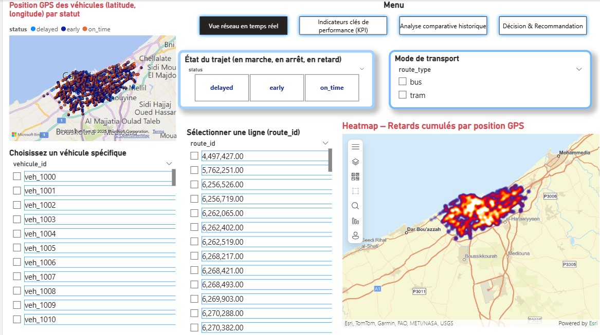
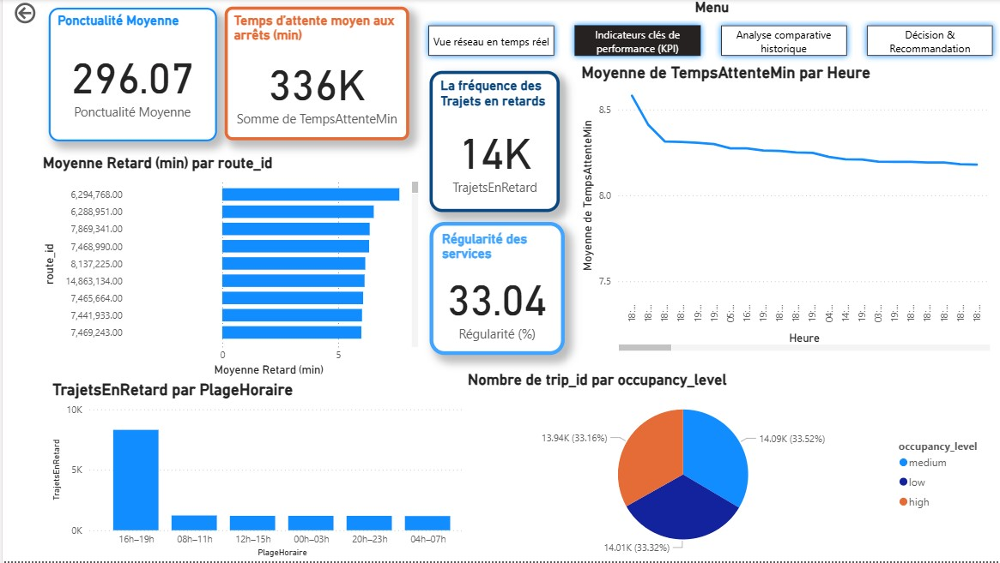
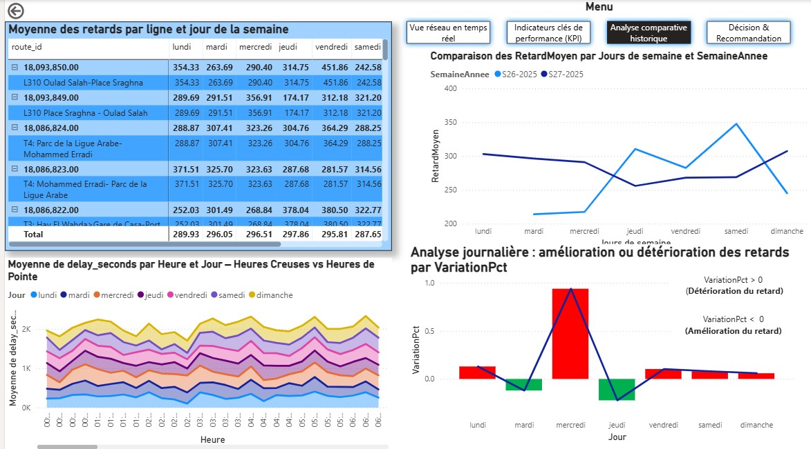
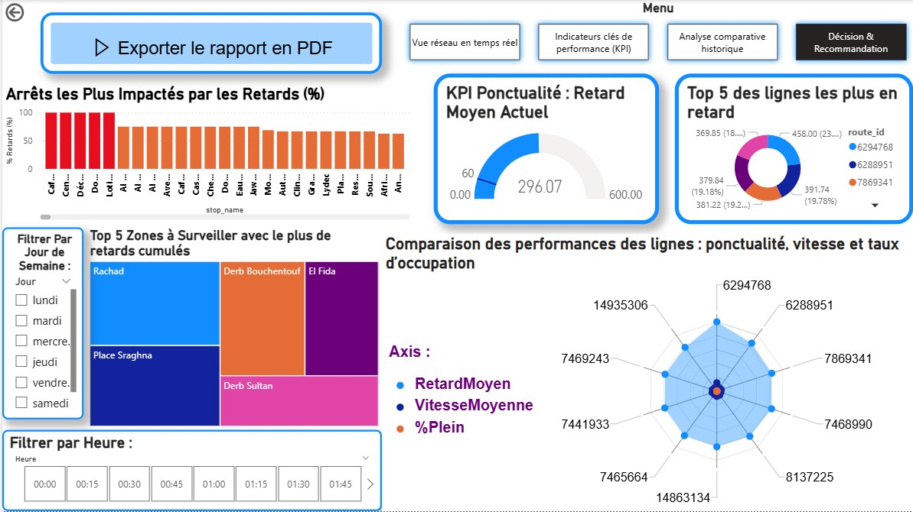

# Dashboard-SmartTrafficCS
# 🚦 Dashboard SmartTraffic-CS

## 🧠 Description du projet
Le projet **SmartTraffic-CS** vise à améliorer la **mobilité urbaine intelligente** dans la région de **Casablanca-Settat** à travers l’exploitation des **données GPS** issues des transports publics (bus, tramway) et partagés (taxis).  

Ce projet consiste à développer un **tableau de bord décisionnel interactif** permettant aux opérateurs et décideurs publics de :
- Suivre en temps réel la **circulation** et les **retards** ;
- Analyser les **performances du réseau** (ponctualité, régularité, congestion) ;
- Appuyer la **prise de décision stratégique** pour améliorer la qualité du service et la fluidité du trafic.

Le tableau de bord est conçu avec **Power BI**, connecté à une base de données **MongoDB**, et s’appuie sur un processus complet d’**extraction, transformation et visualisation des données (ETL)**.

---

## 🎯 Objectifs du projet
1. **Optimiser les trajets et la coordination intermodale** entre bus, tramway et taxis.  
2. **Fournir un outil décisionnel** basé sur des indicateurs de performance en temps réel.  
3. **Améliorer l’expérience utilisateur** grâce à des analyses fiables et visuelles du réseau.  
4. **Faciliter la prise de décision** publique par des analyses historiques et comparatives.  

---

## 🗂️ Sources et architecture des données
### 🔹 Données exploitées :
- Données **GPS en temps réel** : position, vitesse, retards, niveau d’occupation.  
- Données **OpenStreetMap** : arrêts, lignes, itinéraires.  
- Fichiers **CSV** intégrés dans une base **MongoDB**.

### 🔹 Modélisation :
La base de données a été structurée autour de quatre tables principales :
- **Trips** : trajets enregistrés avec coordonnées, vitesses et retards ;  
- **Vehicule** : liste des véhicules identifiés par leur `vehicle_id` ;  
- **Route** : itinéraires, types et lignes de transport ;  
- **Stops** : arrêts et positions GPS.

Relations clés :
- 1 véhicule → plusieurs trajets  
- 1 route → plusieurs trajets  
- 1 arrêt → plusieurs trajets associés  

---

## ⚙️ Outils et technologies
| Outil / Technologie | Rôle principal |
|----------------------|----------------|
| **MongoDB** | Stockage et structuration des données GPS |
| **MongoDB BI Connector** | Connexion entre MongoDB et Power BI |
| **Power Query (Power BI)** | Nettoyage et transformation des données |
| **Power BI Desktop** | Conception du tableau de bord et visualisation |
| **DAX (Data Analysis Expressions)** | Calcul des indicateurs dynamiques (KPI) |

---

## 📊 Structure du tableau de bord Power BI
Le dashboard **SmartTraffic-CS** se compose de **quatre pages interactives**, illustrées ci-dessous 👇

---

### 1️⃣ Vue réseau en temps réel
- Carte interactive des véhicules avec statut (en marche, à l’arrêt, en retard).  
- Filtres dynamiques : ligne, véhicule, statut, type de transport.  
- Carte de chaleur (Heatmap) pour localiser les zones de congestion.  

📸 **Aperçu :**  

---

### 2️⃣ Indicateurs clés de performance (KPI)
- Ponctualité moyenne par ligne.  
- Temps d’attente moyen aux arrêts.  
- Nombre total de trajets en retard.  
- Taux de régularité (%) et niveau d’occupation.  
- Évolution horaire et journalière des retards.  

📸 **Aperçu :**  

---

### 3️⃣ Analyse comparative historique
- Comparaison entre **semaine actuelle et précédente**.  
- Analyse par jour et par heure de la semaine.  
- Matrice (Lignes × Jours) pour identifier les lignes à surveiller.  
- Graphiques temporels : courbes, aires empilées, indices de variation (%).  

📸 **Aperçu :**  

---

### 4️⃣ Décision & Recommandation
- Histogrammes empilés : zones et pourcentages de retards.  
- Jauge KPI : objectif de ponctualité vs réel.  
- Treemaps et Donut charts : zones problématiques et top lignes en retard.  
- Carte radar (spider chart) : score global par critère.  
- Boutons d’exportation PDF pour le reporting automatique.  

📸 **Aperçu :**  

---

## 📈 Indicateurs de performance
| Indicateur | Description |
|-------------|-------------|
| **Ponctualité moyenne** | Retard moyen enregistré par ligne |
| **Temps d’attente moyen** | Délai estimé aux arrêts |
| **Trajets en retard** | Nombre de trajets déclarés en retard |
| **Régularité (%)** | Taux de trajets à l’heure |
| **Variation hebdomadaire (%)** | Évolution des performances entre deux semaines |

---

